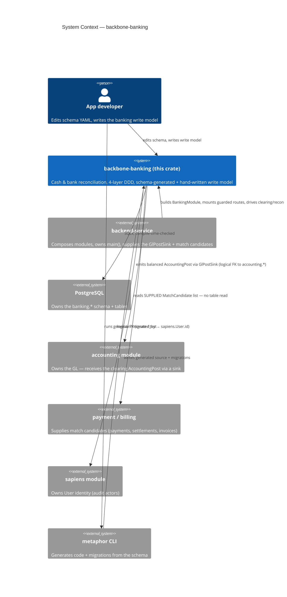
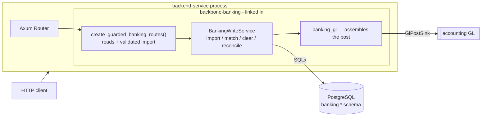
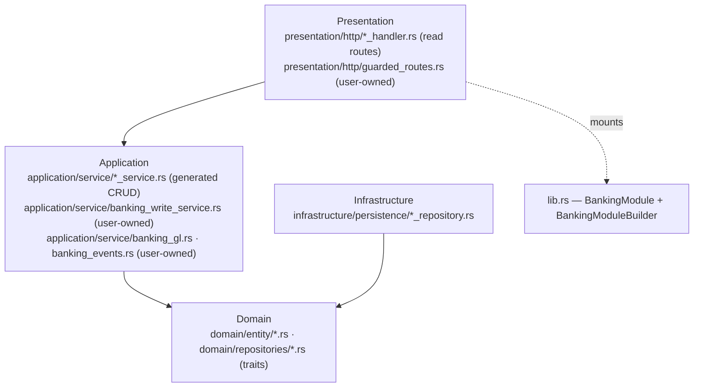
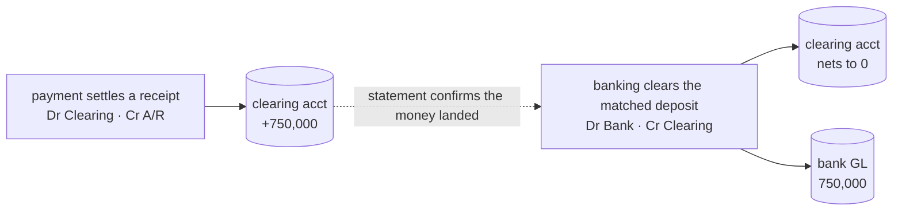

<!-- Reader: Maintainer · Mode: Explanation -->
# Architecture

`backbone-banking` is a **library crate** that owns one bounded domain — cash & bank reconciliation
— as four DDD layers. It does not run on its own: a `backend-service` composes it, hands it a
database pool and a **GL post sink**, and mounts its router. Most of `src/` is generated from the
schema YAML; the interesting 5% — the write model that imports statements, matches lines, and posts
the clearing leg — is hand-written and lives in `user_owned` files the generator never touches.

This page shows the system top-down (C4), then traces the one flow that makes banking *banking*: a
statement line clearing value from the clearing account to the bank account, and the cross-module
seam that proves it.

## The domain in one paragraph

Six entities, one clearing shape. **Bank** + **BankAccount** are the catalogue (each account carries
two GL refs: `gl_account_id` = the real bank account, `clearing_account_id` = undeposited funds).
**BankStatementImport** + **BankTransaction** are an imported statement and its lines.
**BankClearance** matches a line to the document it settles and records the emitted GL post.
**BankReconciliation** is a session over an account + period that closes only when the statement
balance equals the ledger *and* every line is reconciled. Banking posts the **bank-side leg only**;
it reads no sibling module's tables.

## 1. Context

Who uses the module, and what it depends on.



*What to notice: banking has **zero normal dependency** on payment/billing. Matching is done against
a `Vec<MatchCandidate>` the composition supplies; the ledger effect is emitted through a `GlPostSink`
port. Every cross-module link — accounting, payment, sapiens — is a **logical reference**, not a
foreign-key constraint or a table read. That is what lets the modules deploy independently.*

## 2. Containers

The runnable pieces and how they talk. The module compiles into the service binary; there is no
separate banking process. There are **two ways to mount it**, and the difference is a control:



*What to notice: the **recommended** mount is `create_guarded_banking_routes()` — it exposes read
routes plus one validated write (`POST /bank-statements/import`, which checks balance continuity).
Generic create/update/delete CRUD is deliberately **not** on this surface: you cannot POST a
statement whose lines don't reconcile, or soft-delete a bank out from under its accounts. The
unguarded `BankingModule::all_crud_routes()` mounts all 12 endpoints per entity with no domain
validation — trusted/admin/seeding only.*

Matching, clearing, and reconciliation are **not HTTP routes** — they need a `GlPostSink` and
supplied candidates, so they are service/job-driven (`BankingWriteService`), invoked by a
composition layer or a job, not by an anonymous client.

## 3. Components / modules — the DDD 4-layer shape

Dependencies point **inward only**. Domain depends on nothing. Each of the six entities gets a full
generated layer cake; on top sits the hand-written write model.



| Layer | Directory | Holds | May depend on |
|-------|-----------|-------|---------------|
| **Domain** | `src/domain/` | Six entities (`Bank`, `BankAccount`, `BankStatementImport`, `BankTransaction`, `BankClearance`, `BankReconciliation`) with typed ids + `apply_patch`; the enums (`BankAccountType`, `ImportStatus`, `TxnStatus`, `MatchedSourceType`, `MatchMethod`, `ReconStatus`, `SourceFormat`); repository **traits** (ports) | nothing |
| **Application** | `src/application/` | Generated `{Entity}Service` type aliases + DTOs; **the user-owned write core**: `BankingWriteService` (import/match/clear/reconcile), `banking_gl` (assembles the balanced `AccountingPost`), `banking_events` (the event sink) | domain |
| **Infrastructure** | `src/infrastructure/` | `{Entity}Repository` newtypes over `GenericCrudRepository`; the event store | domain, application |
| **Presentation** | `src/presentation/`, `src/routes/` | Generated read/CRUD handlers per entity; **`guarded_routes.rs`** (user-owned) composing the recommended surface | application |
| **Composition** | `src/lib.rs` | `BankingModule` / `BankingModuleBuilder`, `all_crud_routes()`, public re-exports | all layers (it is the root) |

The generated per-entity CRUD (service alias + repository newtype + read handler) is inherited, never
written — see [ADR-0002](adr/adr-0002-generic-crud.md). The four `user_owned` files listed in
[`metaphor.codegen.yaml`](../../metaphor.codegen.yaml) are the *only* hand-written source; everything
else is regenerated from the schema.

## 4. Data & control flow — clearing a deposit, end to end

The signature banking operation: a €/Rp deposit on a statement line is matched to a payment, then
cleared — moving value out of the clearing account and into the bank GL. Trace
`BankingWriteService::clear_transaction`.

```mermaid
sequenceDiagram
    actor Comp as Composition layer / job
    participant W as BankingWriteService
    participant DB as PostgreSQL (banking.*)
    participant GL as banking_gl
    participant Sink as GlPostSink (accounting)
    participant Ev as banking_events

    Comp->>W: propose_match(line_id, candidates[])
    Note over W: exact amount+ref → exact amount → none<br/>reads NO sibling tables — candidates supplied
    W-->>Comp: Some(MatchCandidate) | None

    Comp->>W: clear_transaction(NewClearance, sink)
    W->>DB: BEGIN; advisory lock on the settlement
    Note over W: bound (a): matched ≤ line un-allocated remainder → else over_allocated<br/>bound (b): Σ clearances + matched ≤ settlement amount → else settlement_over_cleared
    W->>GL: assemble post (deposit): Dr Bank · Cr Clearing
    Note over GL: refuse unless Σdebit = Σcredit (else unbalanced_post)
    W->>Sink: post(AccountingPost)
    alt sink rejects
        Sink-->>W: GlRejected{code}
        W->>DB: ROLLBACK — no clearance, no allocation
        W-->>Comp: Err(GlRejected)
    else sink accepts
        Sink-->>W: accounting_post_id, journal_id
        W->>DB: INSERT bank_clearances; bump line.allocated_amount; set status; COMMIT
        W->>Ev: emit BankTransactionCleared
        W-->>Comp: Ok(ClearOutcome)
    end
```

*What to notice:* the clearing post and the `bank_clearances` write are **one transaction**, so a
rejected GL post leaves no clearance and no allocation ([golden case IP-2](../business-flows/golden-cases.md)).
The **two bounds** are the heart of the design: bound (a) stops a line being over-cleared; bound (b),
held under a per-settlement advisory lock, stops the *same* payment being cleared twice against two
statement lines (a re-imported statement, a retry) — which would strand the clearing account at a
phantom credit and overstate the bank GL. A withdrawal reverses the legs (`Dr Clearing · Cr Bank`);
a bank charge is an expense (`Dr Bank Charges · Cr Bank`).

### The cross-module clearing seam

The reason banking exists is to close the loop `payment → accounting → banking → accounting`:



*What to notice:* payment posts the settlement leg; banking posts the **bank-side leg only**. When the
statement confirms the deposit and banking clears it, the **clearing account nets to zero** — the
funds are no longer "undeposited" — and the bank GL holds the cash. Proven end-to-end by
[`tests/clearing_seam.rs`](../../tests/clearing_seam.rs) (case CLSEAM-1), with the settlement bound
proven by CLSEAM-2/3.

## Reconciliation — three states, not two

`BankReconciliation` is a session over an account + period. `reconcile` resolves to one of three
states, and this distinction is a financial control, not cosmetics:

| State | Meaning | Emits `BankReconciliationClosed`? |
|-------|---------|-----------------------------------|
| `open` | statement closing balance ≠ ledger balance (`computed_difference ≠ 0`) | no |
| `balanced` | numbers agree, but open lines remain (`unreconciled_count > 0`) | **no** |
| `closed` | numbers agree **and** zero open lines | yes |

The `balanced` state stops a session signing off "the bank agrees with our books" while transactions
sit unreconciled — a false attestation. `unreconciled_count` is persisted as the exception snapshot.
Proven by [golden case BGC-7](../business-flows/golden-cases.md).

## Where persistence semantics come from

- **Soft delete** is structural: `config.soft_delete: true` in [`index.model.yaml`](../../schema/models/index.model.yaml)
  → `soft_delete`/`restore`/`empty_trash`/`list_deleted` operate on `metadata.deleted_at`.
- **Audit** (`config.audit: true`) → the `metadata` JSONB column carrying `created_at`, `updated_at`,
  `deleted_at`, `created_by`, `updated_by`, `deleted_by`. Timestamps are trigger-managed
  ([`…_add_audit_triggers.up.sql`](../../migrations/)); the `*_by` actor fields are logical FKs to
  `sapiens.User.id`.
- **Own schema** → migrations `CREATE SCHEMA banking` and qualify tables as `banking.<table>`, so
  banking never collides with a sibling module on a table name.
- **Money is exact**: decimals are `@precision(18,2)`, IDR, half-up. Multi-currency/FX clearing is a
  deliberate non-goal today (`unsupported_currency` on any non-IDR line).

## Key decisions

- [ADR-0001](adr/adr-0001-schema-yaml-ssot.md) — schema YAML is the single source of truth.
- [ADR-0002](adr/adr-0002-generic-crud.md) — services/repositories are generic, inherited not written.
- [ADR-0003](adr/adr-0003-custom-markers.md) — regen-safety via CUSTOM markers and `user_owned`.
- [ADR-0004](adr/adr-0004-banking-boundary-and-clearing-seam.md) — banking owns reconciliation, posts
  the clearing leg only, matches via supplied candidates.

---

Next: [Maintainer Guide](05-maintainer-guide.md) — how to add a feature without breaking the machine.
